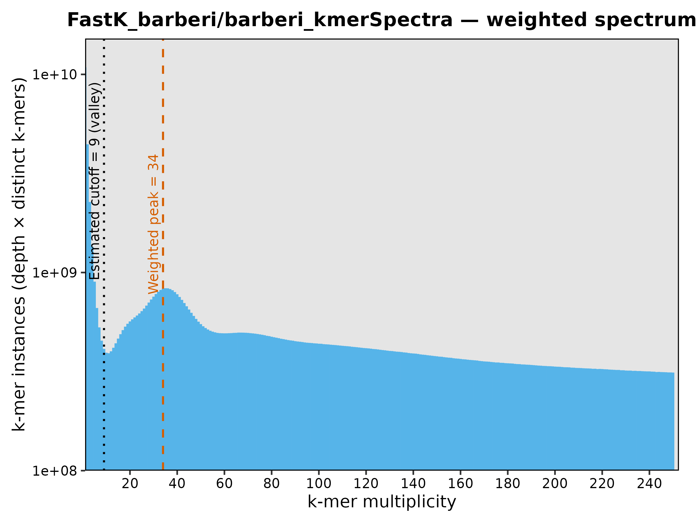
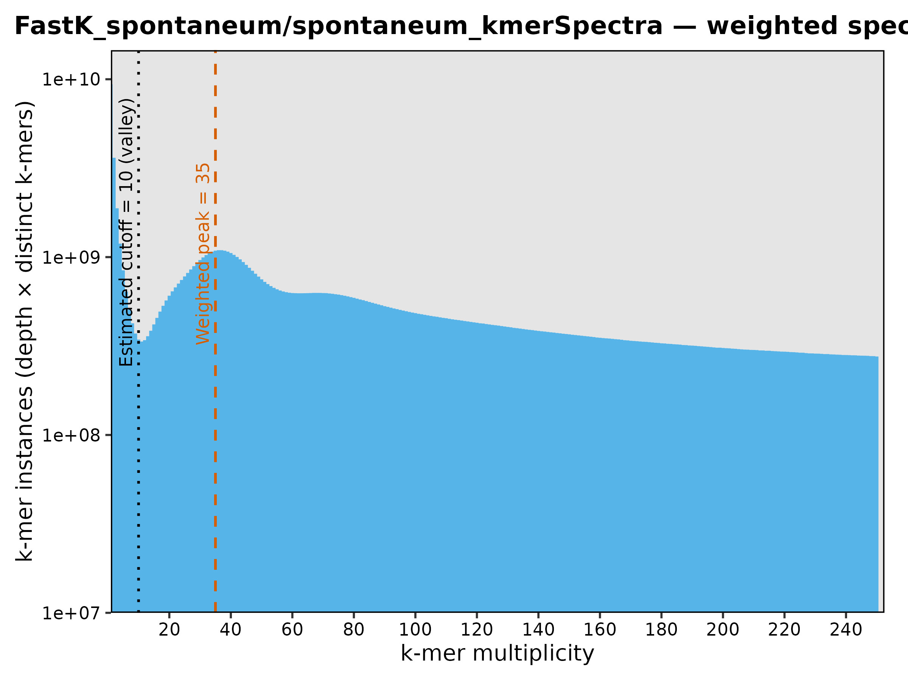
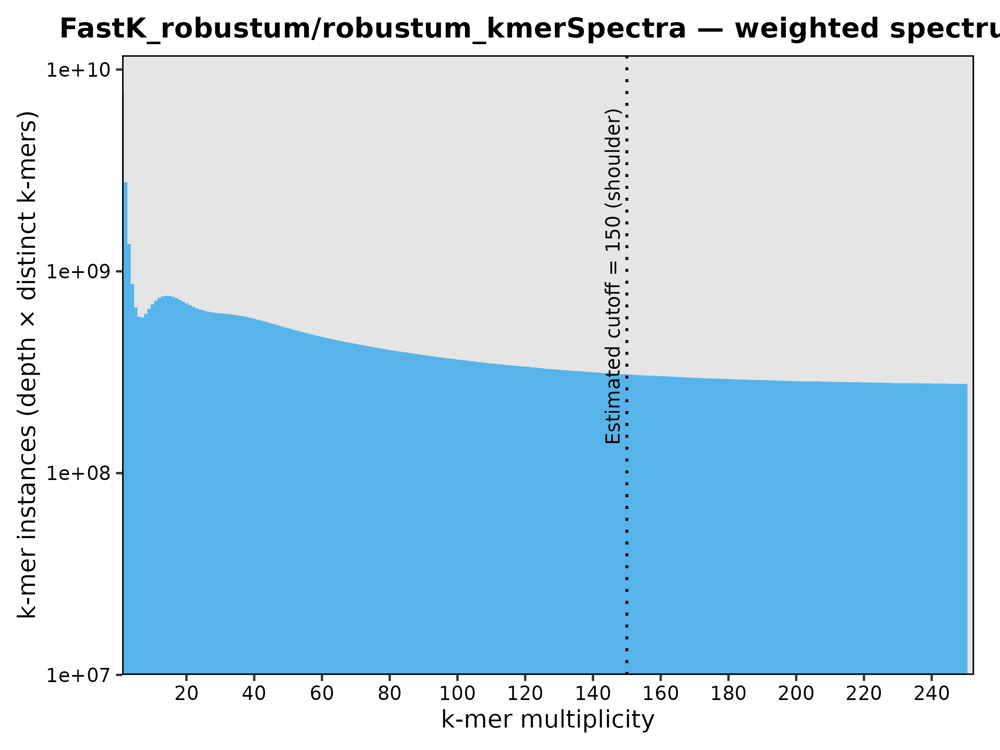
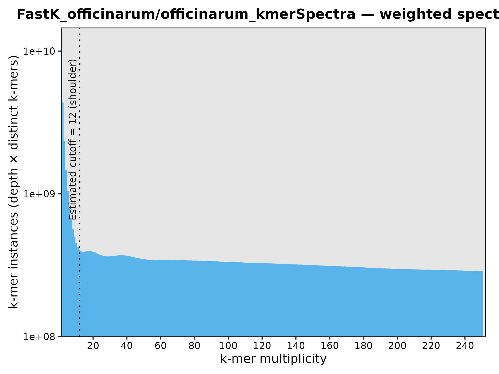
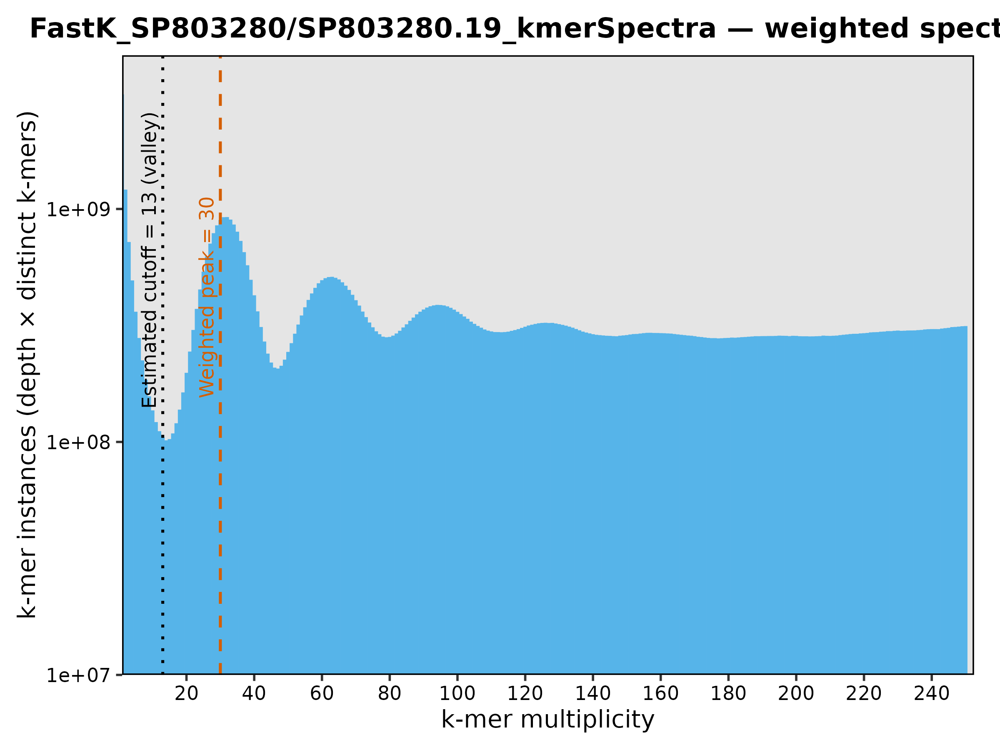

# FastK Kmer Spectra

We are using FastK tro compute Kmer spectra, adn to find species-specific sets of kmers, which could be called anecestry informative kmers.

We will compute kmer spectra over the following data (Illumina paired end data, except SP80-3280 whihc is PacBio HiFi data):

- [*Saccharum barberi*](data/barberi.srrs.txt)
- [*Saccharum spontaneum*](data/spontaneum.srrs.txt)
- [*Saccharum robustum*](data/robustum.srrs.txt)
- [*Saccharum officinarum*](data/officinarum.srrs.txt)
- [*Saccharum hubrid cultivar SP80-3280*](data/SP803280.srrs.txt)

For each species I used FastK v1.2 to compute kmer catalogs. This was done for each accession and then all accession-specific catalogues were merged in to a single species catalog ([script](scripts/submitFastK.sh)). Then histograms were computed with Histex ([script](scripts/submitHistex.sh)) and plotted in R ([script](scripts/plotKmerSpectra.R)).  The plot script tries to identify the first valley (or sustained shoulder), to define the limit between error and genomic kmers. In the case of S. robustum, it did not work, and that limit was defined by visual inspection.

I will use the kmer spectra plot to define the minum depth to consider kmers as genomic, this is in order to exclude error kmers upto that depth.

| Species | Kmer spectra (k=19) | min_Depth (Error kmers) |
| --- | --- | --- |
| *S. barberi* |  | 9 | 
| *S. spontaneum* |  | 10 |
| *S. robustum* |  | 6 |
| *S. officinarum* |  | 12 |
| *SP80-3280* |  | 13 |